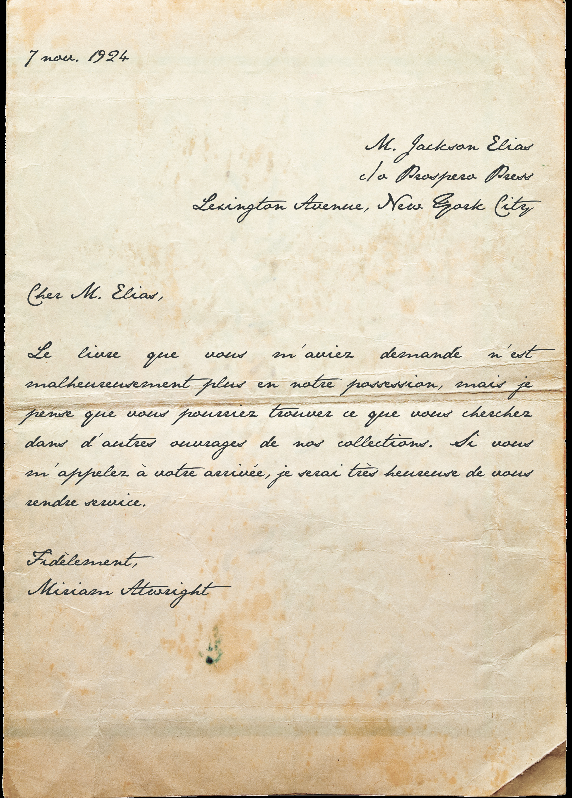

Campagne:: [Les Masques de Nyarlathotep](../Les%20Masques%20de%20Nyarlathotep.md)
Type:: #indice 
Emplacement:: [Chambre 410](../lieu/Chambre%20410.md)
***
# Lettre de Miriam Atwright à Elias

## Description

Une lettre manuscrite – sans enveloppe. Elle a été écrite le 7 novembre 1924 par une certaine [Miriam Atwright](../../Miriam%20Atwright.md), bibliothécaire à l’[Université Harvard](Universit%C3%A9%20Harvard.md) ; elle est adressée à Elias aux bons soins de son éditeur

