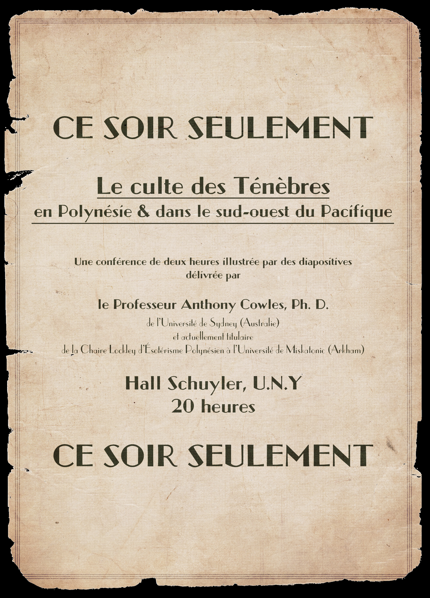

Campagne:: [Les Masques de Nyarlathotep](../Les%20Masques%20de%20Nyarlathotep.md)
Type:: #indice 
Emplacement:: [Chambre 410](../lieu/Chambre%20410.md)

***
# Prospectus pour la conférence du professeur Cowles

## Images

## Description

Une petite feuille de papier. 

Glissée dans le deuxième volume de An History of the Warfare of Science with Technology in Christendom (une Histoire de la guerre entre science et technologie dans la chrétienté), de Andrew Dickson White, elle marque le début du chapitre XIV, From Fetich to Hygiene. 

C’est un prospectus ordinaire, destiné à être envoyé par la poste ou distribué dans la rue.

# Liens

conduit les investigateurs jusqu’au professeur [Anthony Cowles](../../Anthony%20Cowles.md), spécialiste des cultes des ténèbres. Tout comme [Jackson Elias](../../Jackson%20Elias.md), les investigateurs ont raté cette conférence, mais ils peuvent appeler le professeur [Anthony Cowles](../../Anthony%20Cowles.md), lui écrire ou lui rendre visite dans le [Massachusetts](Massachusetts.md).