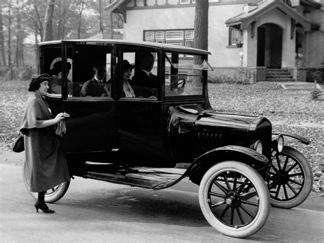

Campagne:: [Les Masques de Nyarlathotep](../../Les%20Masques%20de%20Nyarlathotep.md)
Type:: #indice 
Emplacement:: [New York](New%20York.md)
***
# Voiture volée

## Images

## Description

Livre : [Livret New York](Livret%20New%20York.md)

***

## Voiture volée

Correspond à la [Voiture des tueurs](./Voiture%20des%20tueurs.md)
  
Thomas Whiterspoon est l’homme qui s’est fait voler sa voiture, une vieille Hudson noire. Whiterspoon n’a rien à voir avec l’affaire, il sait juste qu’il a laissé son véhicule dans la rue, la veille au soir, et que le lendemain matin, elle n’y était plus et qu’il a alors signifié sa disparition au poste de police le plus proche
