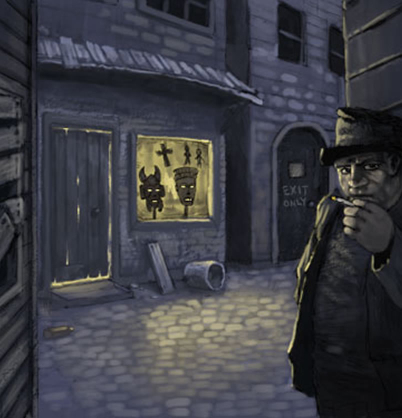
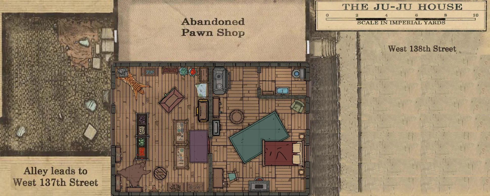
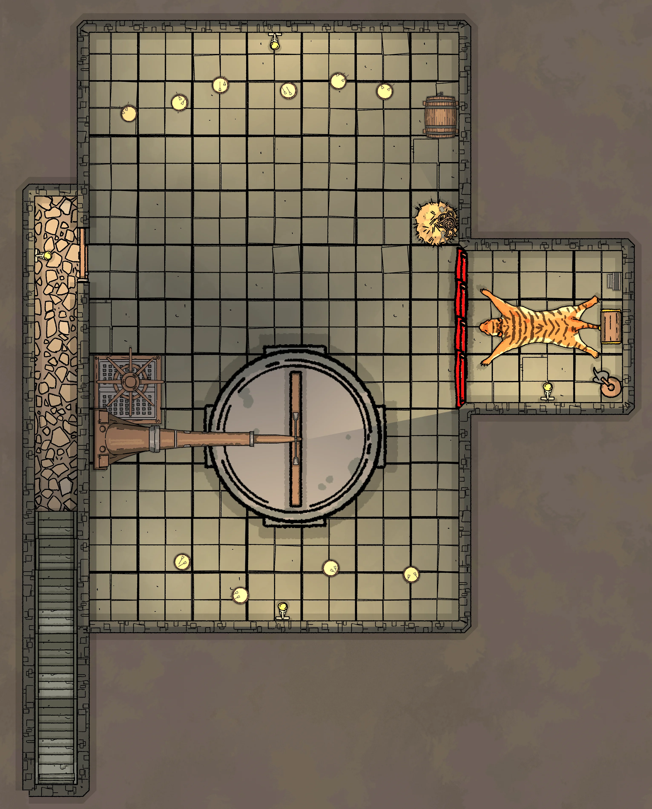
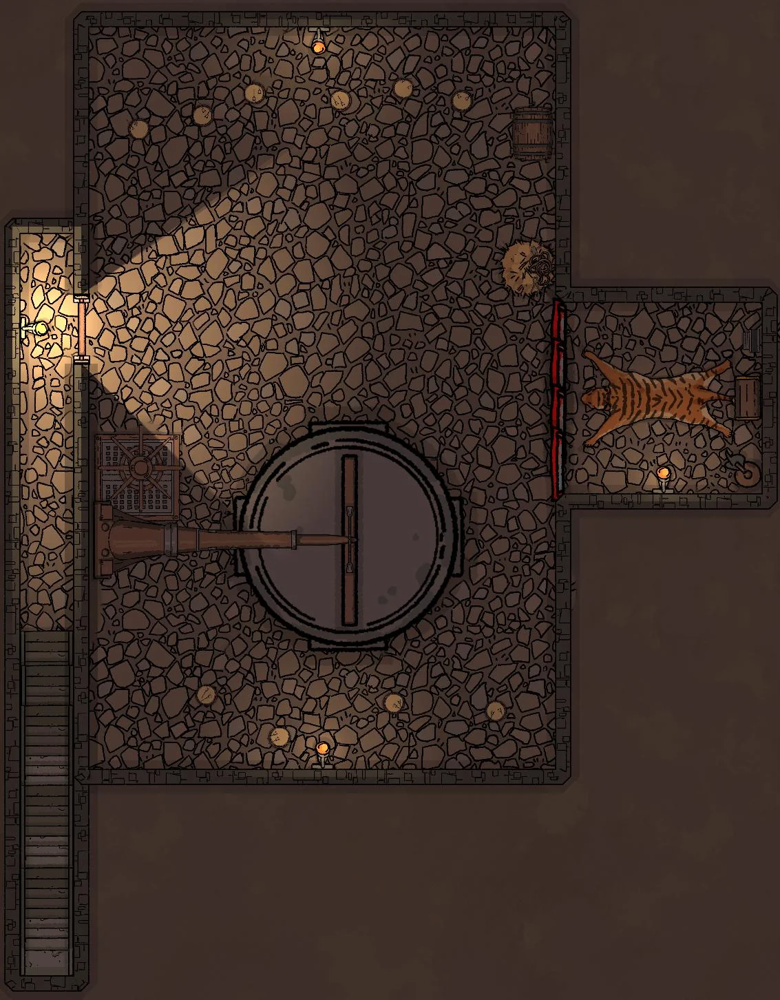

Campagne:: [Les Masques de Nyarlathotep](../Les%20Masques%20de%20Nyarlathotep.md)
Type:: #lieu 
Emplacement:: [New York](New%20York.md)
***
# Boutique Ju-Ju

## Image

## Description
  

La Boutique Ju-Ju se trouve au 1, Ransom court, dans [Harlem](Harlem.md). Cette ruelle sale coupe la 137e rue à l’est de Lenox avenue et aboutit dans une arrière-cour de six mètres sur six. Seule la Boutique Ju-Ju donne sur cette courette. L’unique autre porte appartient un bâtiment abandonné.
La cour est encadrée d’immeubles délabrés et de nombreuses fenêtres la dominent.

La devanture se compose d’une vitrine et d’une porte vitrée. Des rideaux occultent l’intérieur de la boutique.

Dans la vitrine sont exposées des œuvres d’art africaines qui semblent authentiques. Le magasin mesure à peine six mètres sur cinq et [Silas N’Kwane](../../Silas%20N%E2%80%99Kwane.md) semble être seul à s’en occuper.

L’endroit est sale et poussiéreux, encombré du classique bric-à-brac Tribal africain : masques de démons, tambours, armes, animaux empaillés, sculptures sur bois, ivoires, etc. L’atmosphère est oppressante.

***
## Personnages
- [Silas N’Kwane](../../Silas%20N%E2%80%99Kwane.md)

***
## Lieux

***
## Objets & Pistes
- [Masque de la Langue Sanglante](../indices/Masque%20de%20la%20Langue%20Sanglante.md)

## Plans

