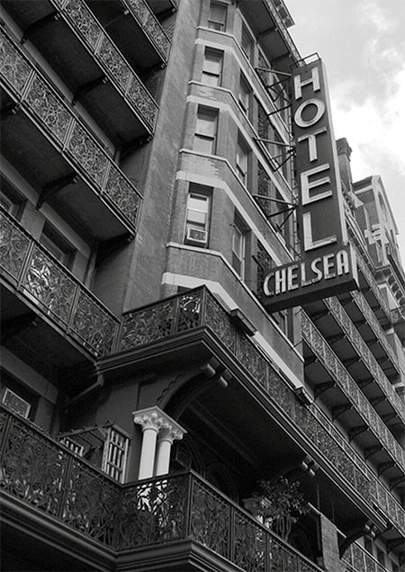

Campagne:: [Les Masques de Nyarlathotep](../../Les%20Masques%20de%20Nyarlathotep.md)
Type:: #lieu
Emplacement:: [New York](New%20York.md)
***
# Hôtel Chelsea

## Images 

## Description

---
Achevé en 1883, l’hôtel Chelsea, ce grand bâtiment de briques rouges, devient un hôtel au début du XXe siècle après avoir été une coopérative d’habitation privée. Il deviendra ensuite le haut lieu de rencontre du showbiz new-yorkais, avant que le point d’ancrage de celui-ci ne se déplace vers Broadway. Derrière une devanture caractérisée par ses balcons en fer forgé, le hall mène vers un puits de lumière central dans lequel grimpe un escalier en colimaçon à angle droit.

Les couloirs qui rayonnent à chaque étage sont isolés du centre par des portes à double battant vitrées. Dans les chambres, derrières les fenêtres à guillotine, on trouve cette odeur caractéristique de renfermé, de moisi, ce remugle propre aux vieux bâtiments, imprégné dans les dessus-de-lit râpés et les murs défraîchis.

**Gérant** : [Winston Bard](../../Winston%20Bard.md)

**Personnel** : aucun de nuit hormis Winston ou un réceptionniste ; personnel de ménage ou autres réparateurs dans la journée.

***
## Personnages liés
- [Martin Poole](../../Martin%20Poole.md)
- [Winston Bard](../../Winston%20Bard.md)

***
## Lieux
- [Chambre 410](./Chambre%20410.md)

***
## Objets & Pistes
- [Marque sur le front d’Elias](../indices/Marque%20sur%20le%20front%20d%E2%80%99Elias.md)
- [Voiture des tueurs](../indices/Voiture%20des%20tueurs.md)

